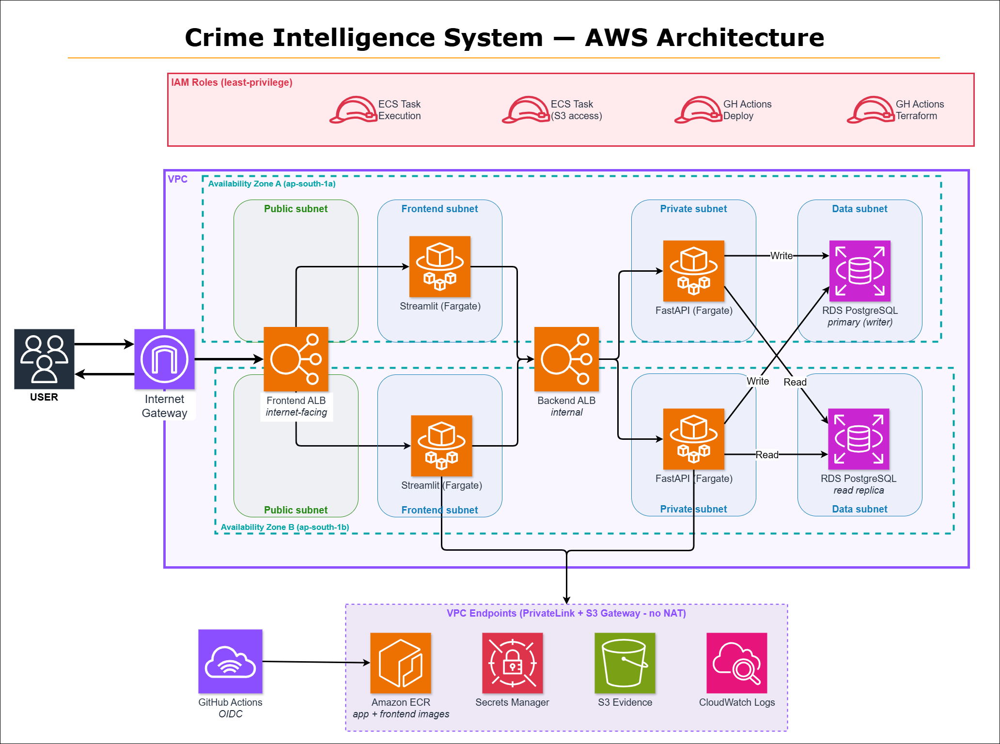

<div align="center">

# 🛡️ Crime Intelligence System

**Full-stack criminal investigation management platform — FastAPI + Streamlit on AWS ECS Fargate, fully Terraform-provisioned with OIDC CI/CD.**

Tracks the complete lifecycle of a criminal case: persons (multi-role), cases, evidence, suspects, witnesses, victims, trials, punishments, and crime-hotspot analytics.


</div>

> **Deployment note:** The full stack is provisioned on AWS via a single `terraform apply`. It is **not kept running 24/7** (cost control) — see the demo video and architecture below. Infrastructure spins up on demand in ~30 minutes.

---

## 🎬 Demo


[Watch the demo](https://youtu.be/GiN5sfaihsA)

<sub>Didn't keep the live link up — AWS billing has feelings too..</sub>

---

## 🏛️ Architecture



A two-Availability-Zone VPC on `ap-south-1`, fully private data plane:

- **Internet-facing ALB** → **Streamlit** frontend (Fargate, one task per AZ)
- **Internal ALB** → **FastAPI** backend (Fargate, one task per AZ) — the API is never directly exposed to the internet
- **RDS PostgreSQL** primary (writer) + **read replica**, with application-level read/write routing
- **S3** for evidence files (AES256, versioned)
- **Secrets Manager** for `DATABASE_URL` + `JWT_SECRET` (injected at task start, never baked into the image)
- **VPC endpoints** (PrivateLink + S3 gateway) so private subnets have **no internet egress path at all**

### Request flow (layered)

```text
Browser → Internet-facing ALB → Streamlit (Fargate)
                                     │  HTTP /api/v1
                                     ▼
                              Internal ALB → FastAPI (Fargate)
                                     │
        Routes → Pydantic Schemas → CRUD → SQLAlchemy ORM → RDS PostgreSQL
                                                  │
                                                  └→ S3 (evidence files)
```

---

## ☁️ Cloud & DevOps Highlights

This is the part that goes beyond a typical CRUD project:

- **100% Infrastructure as Code** — 8 modular Terraform components (`vpc`, `ecs`, `rds`, `iam`, `alb`, `s3`, `secrets`, `endpoints`), remote state in S3.
- **Zero static AWS keys** — GitHub Actions authenticates via **OIDC federation** and assumes least-privilege IAM roles.
- **Fully private network** — no NAT gateway; all AWS API traffic flows through VPC endpoints. Private subnets have no route to the internet (defense in depth).
- **Multi-AZ & resilient** — Fargate tasks and RDS spread across two AZs; encrypted at rest; 7-day automated backups.
- **Read/write splitting** — a custom SQLAlchemy routing session sends writes (flush / INSERT / UPDATE / DELETE) to the primary and `SELECT`s to the read replica, falling back transparently to the writer when no replica is configured.
- **CI/CD pipeline** — on push to `main`: build image → push to ECR → run DB migration as a one-off Fargate task → roll the ECS service → poll `/health/ready` (fails the deploy on a bad health check).

---

## ✨ Features

- **Cases** — open / update / close, filter by crime type, city, status, date range; combined detail view (evidence, witnesses, suspects, trials, victims, testimonies)
- **Persons (multi-role)** — one person can simultaneously be a suspect, witness, victim, officer, or criminal across different cases
- **Evidence** — metadata + file upload to S3 (pdf/txt/jpg/png, ≤10 MB, AES256)
- **Witnesses & testimony** — record statements and link them to the suspects they point to
- **Suspects, victims, trials, hearings, punishments** — full investigation workflow
- **Crime hotspot analytics** — case-count aggregation by city with date filters
- **Auth** — JWT (HS256, 1h) with **Argon2** password hashing; protected endpoints via FastAPI dependency injection
- **40+ REST endpoints** across 9 domains, auto-documented via OpenAPI / Swagger UI

---

## 🛠️ Tech Stack

| Layer | Technology |
|-------|-----------|
| **Backend** | FastAPI, Pydantic v2, SQLAlchemy 2.0 |
| **Frontend** | Streamlit |
| **Database** | PostgreSQL 16 (19-table normalized schema) |
| **Auth** | PyJWT (HS256) + Argon2 |
| **Storage** | AWS S3 (evidence files) |
| **Infra** | AWS ECS Fargate, RDS, ALB, VPC, Secrets Manager · Terraform |
| **CI/CD** | GitHub Actions (OIDC) → ECR → ECS |
| **Containers** | Docker, Docker Compose |

---

## 🚀 Quick Start (local)

The whole stack runs locally with one command — no need to install PostgreSQL.

```bash
git clone <repository-url>
cd Crime-Tracking-and-Analysis-Database
docker compose up --build
```

Then open the interactive API docs:

```text
http://localhost:8000/docs
```

Compose starts PostgreSQL 16, creates the `crimedb` database, loads the schema + seed data, and runs the FastAPI backend.

**Reset the database** (SQL files only run on first volume creation):

```bash
docker compose down -v && docker compose up --build
```

**Run the unit tests:**

```bash
pip install -r requirements.txt
pytest tests/test_db_routing.py -v
```

---

<details>
<summary><b>🗄️ Database Design (19 tables, BCNF-normalized)</b></summary>

<br>


**Design decisions:**

- **Person-role pattern** — a base `Person` row plus role-specific tables (`Police_Officer`, `Suspect`, `Victim`, `Witness`, `Criminal`) linked by FK, so one person holds multiple roles at once.
- **Composite primary keys** — `Case_Details(case_id, open_date)` and `Trial(case_id, open_date, trial_number)`; lookup helpers default to the latest `open_date`.
- **Named schema** — all tables live in the `crimedb` schema (not `public`); `search_path` is set per connection.
- **Junction tables** — `Collected_For`, `Assigned_To`, `Testifies_In`, `Involved_In`, `Affected_By`, `Linked_To`, `Pointed_To`, `Punishment` model the many-to-many relationships between people, cases, and evidence.

See [`Docs/relational_schema.svg`](Docs/relational_schema.svg) and [`Docs/Queries.sql`](Docs/Queries.sql) for the full schema and analytical queries.

</details>

<details>
<summary><b>📁 Project Structure</b></summary>

<br>

```text
App/
  main.py            FastAPI entry; mounts /api/v1; /health + /health/ready
  API/
    deps.py          Per-request DB session dependency
    Routing/         Domain routers (cases, persons, evidence, suspects, ...)
  CRUD/              Business logic + DB operations per domain
  schema/            Pydantic request/response models
  db/
    session.py       Engines (writer + read replica) + routing session
    models.py        19 SQLAlchemy ORM models
    setup_db.py      Idempotent DB init (schema + seed)
Database/
  schema.sql         DDL for 19 tables
  seed_data.sql      Test data
streamlit_app/       Streamlit frontend (Home + Dashboard, Persons, Analytics, New Record)
infra/               Terraform — 8 modules (vpc, ecs, rds, iam, alb, s3, secrets, endpoints)
tests/               Unit + integration tests
.github/workflows/   deploy.yml (app CI/CD) + infra.yml (terraform plan/apply)
Docs/                Architecture diagram, ER diagram, schema, queries
```

</details>

---

## 🔌 API Overview

| Domain | Base path | Highlights |
|--------|-----------|-----------|
| Cases | `/api/v1/cases` | open/close, filtered list, combined detail view, officer assignment |
| Persons | `/api/v1/persons` | multi-role CRUD, per-person case history |
| Evidence | `/api/v1/.../evidence` | metadata + S3 file upload |
| Suspects | `/api/v1/.../suspects` | arrest status, evidence linking |
| Witnesses | `/api/v1/.../witnesses` | testimony recording, suspect pointing |
| Victims | `/api/v1/.../victims` | per-case + global listing |
| Trials | `/api/v1/.../trials` | hearings, judge assignment, punishments |
| Auth | `/api/v1/auth` | register, login (JWT), change password |
| Analytics | `/api/v1/analytics` | crime hotspots by city |

Full interactive documentation at `/docs` when the app is running.
---

## 🔮 Roadmap

- HTTPS on the ALB (ACM certificate + HTTP→HTTPS redirect)
- Password reset via OTP
- Expanded read-replica usage for analytics-heavy endpoints
- Container Insights / structured request tracing
